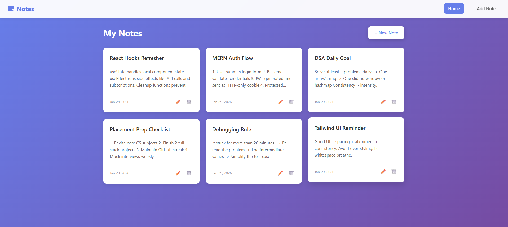
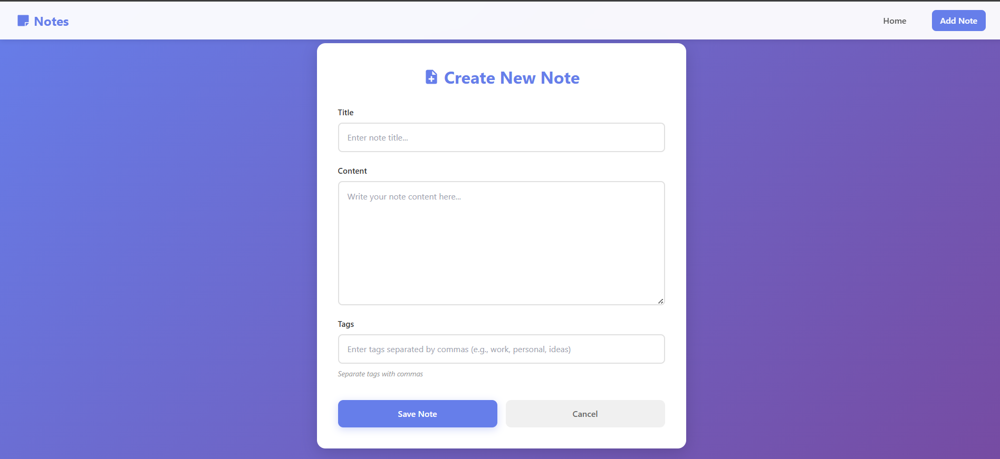
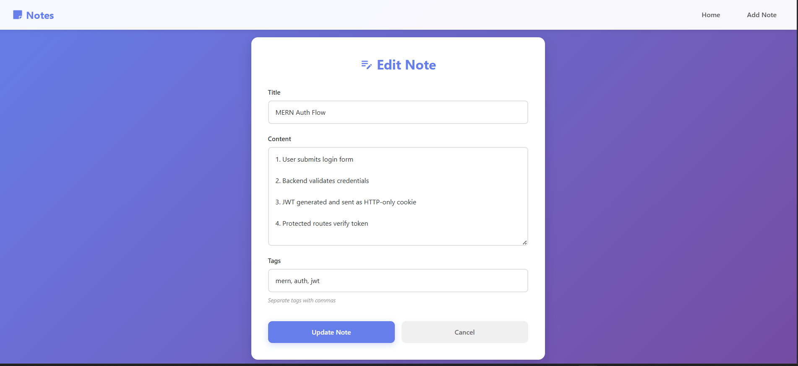
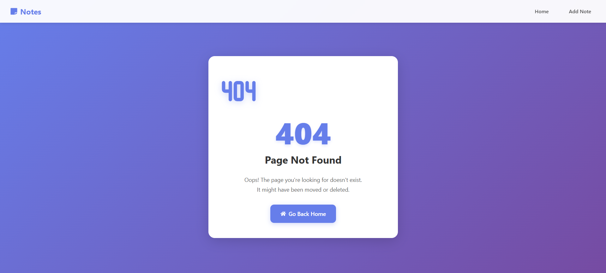

# Notes App

A modern, full-stack notes application built with React and Node.js. Create, edit, and organize your notes with a beautiful purple-themed UI.

  

## Screenshots

### Home Page

*View all your notes in a beautiful grid layout with edit and delete options*

### Add Note

*Create new notes with title, content, and tags*

### Edit Note

*Update existing notes with pre-populated data*

### 404 Page

*Custom error page with smooth animations*

## Features

- **Create Notes** - Add new notes with title, content, and tags
- **Edit Notes** - Update existing notes easily
- **Delete Notes** - Remove notes you no longer need
- **Tag System** - Organize notes with comma-separated tags
- **Modern UI** - Beautiful purple gradient theme with smooth animations
- **Responsive Design** - Works seamlessly on desktop and mobile
- **Fast & Lightweight** - Built with Vite for optimal performance
- **Custom 404 Page** - User-friendly error handling

## Tech Stack

### Frontend
- **React 19.2** - UI library
- **React Router DOM** - Client-side routing
- **Vite** - Build tool and dev server
- **Tailwind CSS** - Utility-first CSS framework
- **React Icons** - Icon library
- **Axios** - HTTP client

### Backend
- **Node.js** - Runtime environment
- **Express.js** - Web framework
- **MongoDB** - NoSQL database
- **Mongoose** - MongoDB ODM
- **CORS** - Cross-origin resource sharing
- **dotenv** - Environment variable management

## Prerequisites

Before you begin, ensure you have the following installed:
- **Node.js** (v16 or higher)
- **npm** or **yarn**
- **MongoDB** (local installation or MongoDB Atlas account)

## Installation

### 1. Clone the Repository
```bash
git clone <your-repository-url>
cd Notes-app
```

### 2. Install Server Dependencies
```bash
cd server
npm install
```

### 3. Install Client Dependencies
```bash
cd ../client
npm install
```

### 4. Environment Setup

Create a `.env` file in the **server** directory:

```env
PORT=5000
MONGO_URI=your_mongodb_connection_string
```

**For MongoDB Atlas:**
1. Go to [MongoDB Atlas](https://www.mongodb.com/cloud/atlas)
2. Create a free cluster
3. Get your connection string
4. Replace `your_mongodb_connection_string` with your actual connection string

**For Local MongoDB:**
```env
MONGO_URI=mongodb://localhost:27017/notes-app
```

## Running the Application

### Start the Backend Server
Open a terminal in the `server` directory:
```bash
cd server
npm run dev
```
The server will start on `http://localhost:5000`

### Start the Frontend
Open another terminal in the `client` directory:
```bash
cd client
npm run dev
```
The client will start on `http://localhost:5173`

### Access the Application
Open your browser and navigate to:
```
http://localhost:5173
```

## Project Structure

```
Notes-app/
├── client/                 # Frontend React application
│   ├── public/            # Static assets
│   ├── src/
│   │   ├── api/           # API client functions
│   │   │   ├── client.js  # Axios configuration
│   │   │   └── notes.js   # Notes API calls
│   │   ├── assets/        # Images and static files
│   │   ├── components/    # Reusable components
│   │   │   └── Navbar.jsx
│   │   ├── layouts/       # Layout components
│   │   │   └── Main.jsx
│   │   ├── pages/         # Page components
│   │   │   ├── NotesPage.jsx
│   │   │   ├── AddNote.jsx
│   │   │   ├── EditPage.jsx
│   │   │   └── NotFound.jsx
│   │   ├── App.jsx        # Main App component
│   │   ├── main.jsx       # Entry point
│   │   └── main.css       # Global styles
│   ├── package.json
│   └── vite.config.js
│
├── server/                # Backend Node.js application
│   ├── config/
│   │   └── db.js          # Database configuration
│   ├── Controllers/
│   │   └── NotesController.js
│   ├── Middlewares/
│   │   └── ErrorHandler.js
│   ├── Models/
│   │   └── NotesModel.js  # Mongoose schema
│   ├── Routes/
│   │   └── NotesRoutes.js
│   ├── server.js          # Entry point
│   └── package.json
│
├── .gitignore
└── README.md
```

## API Endpoints

### Notes API

| Method | Endpoint | Description |
|--------|----------|-------------|
| GET | `/api/notes` | Get all notes |
| GET | `/api/notes/:id` | Get a single note by ID |
| POST | `/api/notes` | Create a new note |
| PUT | `/api/notes/:id` | Update a note by ID |
| DELETE | `/api/notes/:id` | Delete a note by ID |

### Request Body Example (POST/PUT)
```json
{
  "title": "My Note Title",
  "content": "This is the content of my note",
  "tags": ["work", "important", "personal"]
}
```

## Features Walkthrough

### Home Page
- View all your notes in a beautiful grid layout
- Each note card displays title, content preview, date, and action buttons
- Hover effects for better interactivity

### Add Note
- Clean form with title, content, and tags fields
- Real-time form validation
- Beautiful submission animations

### Edit Note
- Pre-populated form with existing note data
- Update any field and save changes
- Cancel option to go back without saving

### 404 Page
- Custom designed error page
- Animated 404 icon
- Quick navigation back to home

## Building for Production

### Build the Client
```bash
cd client
npm run build
```
The production-ready files will be in the `client/dist` directory.

### Deploy
You can deploy the application to platforms like:
- **Frontend**: Vercel, Netlify, GitHub Pages
- **Backend**: Heroku, Railway, Render
- **Database**: MongoDB Atlas (cloud)

## Contributing

Contributions are welcome! Please feel free to submit a Pull Request.

1. Fork the project
2. Create your feature branch (`git checkout -b feature/AmazingFeature`)
3. Commit your changes (`git commit -m 'Add some AmazingFeature'`)
4. Push to the branch (`git push origin feature/AmazingFeature`)
5. Open a Pull Request

## License

This project is open source and available under the [MIT License](LICENSE).

## Author

Created by Aryan

## Acknowledgments

- React Icons for the beautiful icon set
- Tailwind CSS for the utility classes
- MongoDB for the database solution
- All contributors who help improve this project
